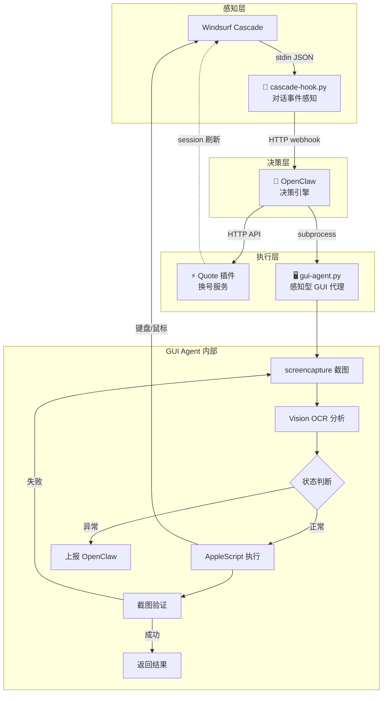
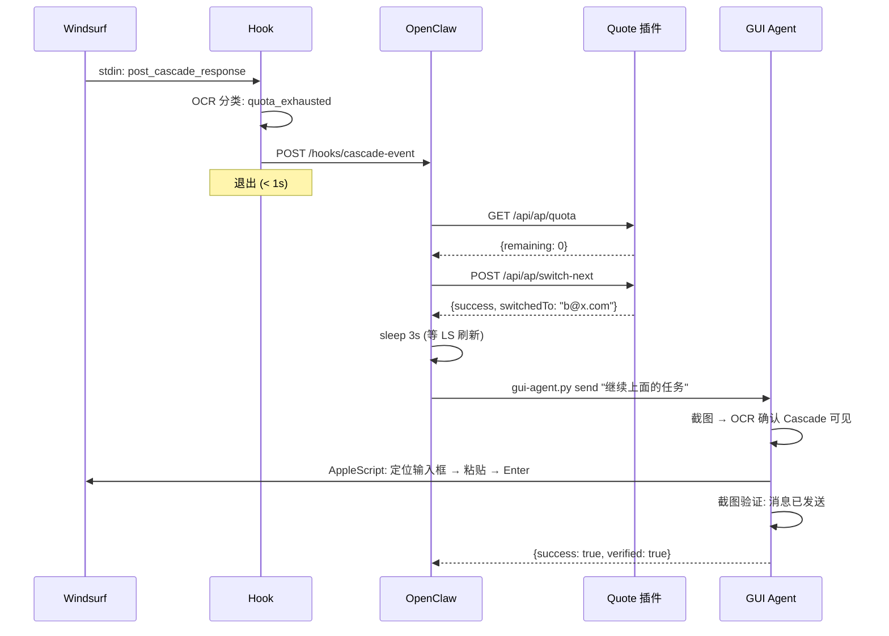
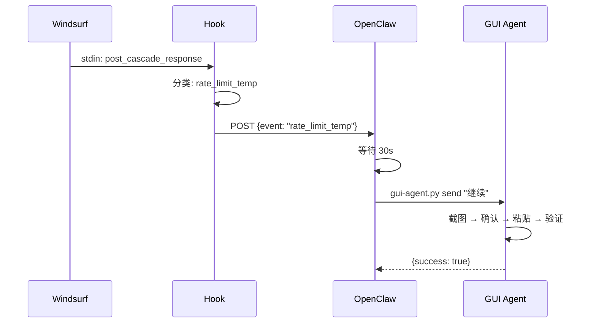
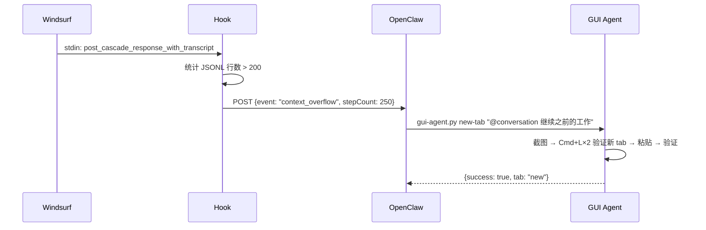
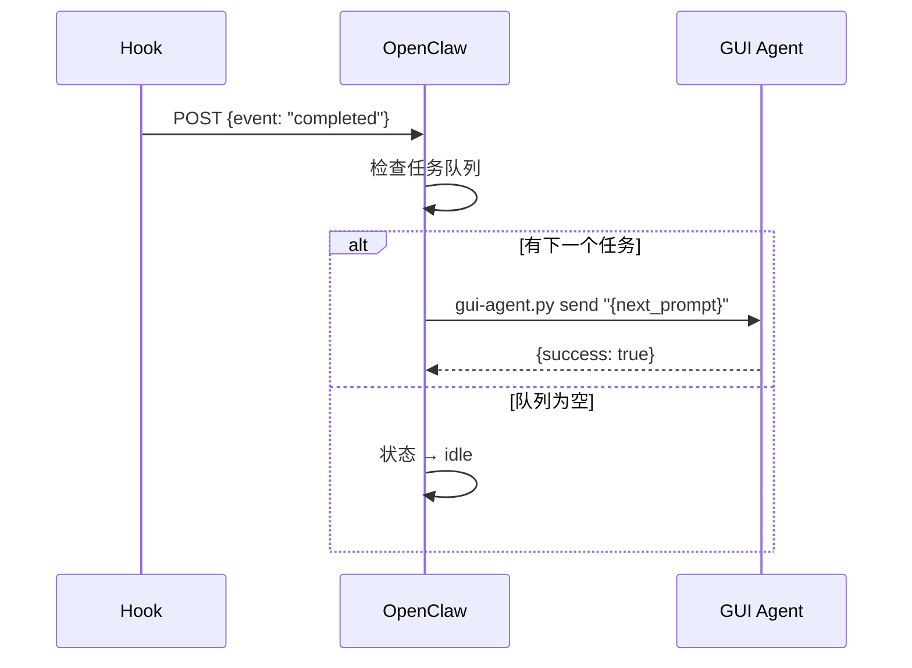
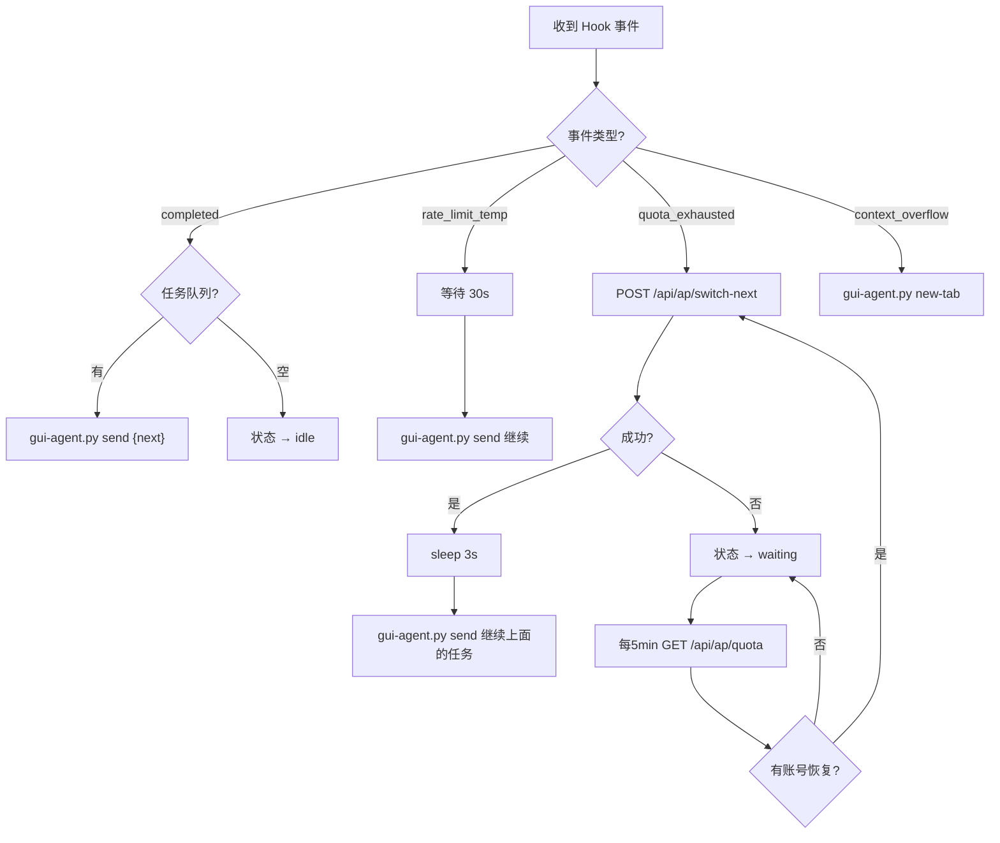
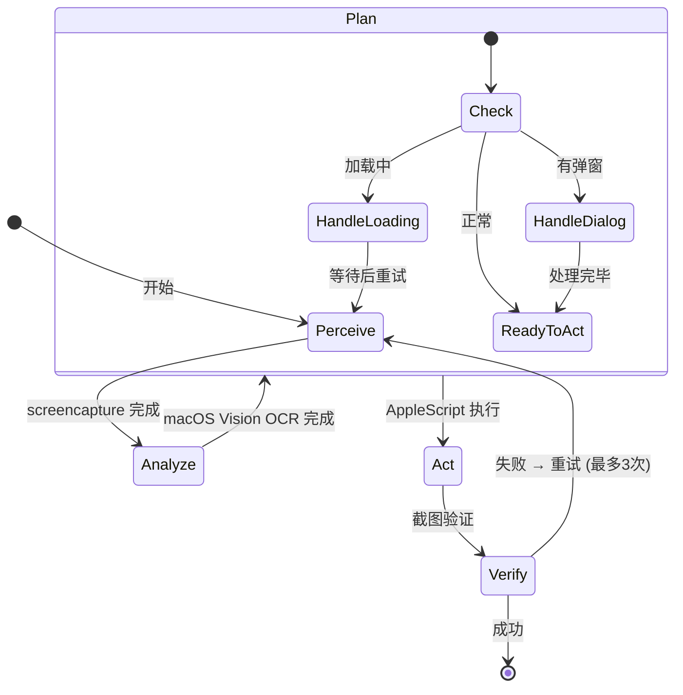
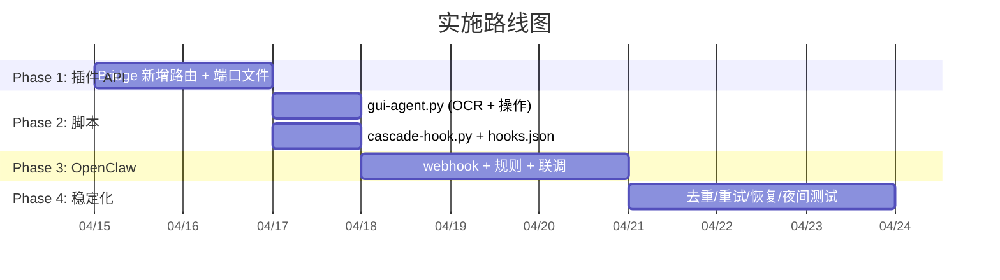

# Windsurf Cascade Autopilot — 架构设计

> **版本**: v2.0 | **日期**: 2026-04-14 | **状态**: 设计中
>
> 目标：实现 Windsurf Cascade 的无人值守自动化，当遭遇 rate limit / 配额耗尽 / 上下文过长时，自动换号、新建会话、继续任务。
>
> 架构：**四方职责分离** — Hook 感知事件 → OpenClaw 决策 → Quote 插件换号 → GUI Agent 操作界面。
>
> 约束：macOS only（AppleScript + Vision OCR）| Windsurf 不提供程序化控制 Cascade 的 API，GUI 操作是唯一路径。

---

## §1 架构总览

### 1.1 架构图



### 1.2 职责矩阵

| 组件 | 职责 | **不做什么** | 技术栈 |
|------|------|-------------|--------|
| **Cascade Hook** `cascade-hook.py` | 解析 Cascade 回复 → 分类事件 → 通知 OpenClaw | 不做决策、不做操作 | Python, stdin → HTTP POST |
| **OpenClaw** | 决策大脑：何时换号、重试、新 session | 不直接操作任何东西 | 规则引擎 + webhook |
| **Quote 插件** `bridge.ts` | 换号、配额查询、状态 API | 不操作 GUI、不做决策 | TypeScript, HTTP server |
| **GUI Agent** `gui-agent.py` | 截图感知 → GUI 操作 → 验证结果 | 不换号、不做业务决策 | Python + screencapture + macOS Vision OCR + AppleScript |

### 1.3 通信协议

```
Hook ──HTTP POST──▶ OpenClaw (:9090)
                        │
                        ├──HTTP──▶ Quote 插件 (:3456, 端口从 ~/.quote-bridge-port 读取)
                        │
                        └──subprocess──▶ gui-agent.py (返回 JSON stdout)
```

### 1.4 关键文件

| 文件 | 位置 | 说明 |
|------|------|------|
| `cascade-hook.py` | `scripts/autopilot/` | Hook 脚本，被 Windsurf 调用 |
| `gui-agent.py` | `scripts/autopilot/` | 感知型 GUI 代理 |
| `bridge.ts` | `src/core/` | Quote 插件 HTTP 服务（新增 `/api/ap/*` 路由） |
| `hooks.json` | `~/.codeium/windsurf/hooks.json` | Windsurf Hook 配置 |
| `.quote-bridge-port` | `~/` | Quote 插件端口发现文件 |
| `.quote-autopilot.log` | `~/` | Hook 脚本日志 |

---

## §2 数据流

### 2.1 场景 A：配额耗尽 → 换号 → 继续



### 2.2 场景 B：临时限速 → 等待 → 重试



### 2.3 场景 C：上下文过长 → 新会话



### 2.4 场景 D：任务完成 → 下一个



---

## §3 决策引擎 (OpenClaw)



### 3.1 去重规则

- 同一 `trajectoryId` 5s 内只处理一次（两个 Hook 可能同时触发）
- GUI Agent 返回失败时重试最多 3 次，间隔 1s

### 3.2 OpenClaw 配置示例

```yaml
name: windsurf-autopilot
triggers:
  - webhook: /hooks/cascade-event

vars:
  bridge_port_file: ~/.quote-bridge-port
  gui_agent: ~/Desktop/code/tmp/ai-quote/scripts/autopilot/gui-agent.py

rules:
  - when: event == "quota_exhausted"
    do:
      - http_post: "http://127.0.0.1:{bridge_port}/api/ap/switch-next"
      - wait: 3s
      - exec: "python3 {gui_agent} send '继续上面的任务'"

  - when: event == "rate_limit_temp"
    do:
      - wait: 30s
      - exec: "python3 {gui_agent} send '继续'"

  - when: event == "context_overflow"
    do:
      - exec: "python3 {gui_agent} new-tab '@conversation 继续之前的工作'"

  - when: event == "completed"
    do:
      - dequeue_next_task:
          on_task: exec "python3 {gui_agent} send '{task.prompt}'"
          on_empty: set_state idle

nightwatch:
  pre_start:
    - exec: "caffeinate -dims -t 28800 &"
  health_check:
    interval: 5m
    do:
      - exec: "python3 {gui_agent} status"
      - http_get: "http://127.0.0.1:{bridge_port}/api/ap/quota"
```

---

## §4 组件接口规格

### 4.1 Quote 插件 HTTP API

在 `bridge.ts` 新增路由，handler 直接调用 `WindsurfAccountManager` 已有方法。

| 路由 | 方法 | 响应 | 调用方法 |
|------|------|------|----------|
| `/api/ap/accounts` | GET | `{accounts: [...]}` (password 脱敏) | `getAll()` |
| `/api/ap/quota` | GET | `{current: {...}, all: [...]}` | `getCurrentAccount()` + `getAll()` |
| `/api/ap/switch` | POST `{accountId}` | `{success, switchedTo?}` | `switchTo(id)` |
| `/api/ap/switch-next` | POST | `{success, switchedTo?}` | `autoSwitchIfNeeded()` |
| `/api/ap/refresh` | POST | `{success, count}` | `fetchAllRealQuotas()` |

**端口发现**: Bridge 启动后写 `~/.quote-bridge-port`，`deactivate()` 时清理。

### 4.2 GUI Agent (`gui-agent.py`)

#### 感知-行动循环



#### CLI 接口

| 命令 | 内部流程 | 返回 JSON |
|------|----------|-----------|
| `gui-agent.py status` | 截图 → OCR → 返回状态 | `{"cascade_visible", "input_ready", "has_dialog", "has_loading"}` |
| `gui-agent.py send "消息"` | 截图 → 确认 Cascade → 定位输入框 → 粘贴 → Enter → 验证 | `{"success", "verified"}` |
| `gui-agent.py new-tab "消息"` | 截图 → Cmd+L×2 → 验证新 tab → 粘贴 → Enter → 验证 | `{"success", "tab": "new"}` |
| `gui-agent.py read-state` | 截图 → OCR Cascade 面板 → 提取最后回复 | `{"last_response", "has_error"}` |
| `gui-agent.py dismiss-dialog` | 截图 → 检测弹窗 → ESC/关闭 → 验证 | `{"success"}` |

#### 感知技术栈

| 层 | 技术 | 用途 | 速度 |
|----|------|------|------|
| 截图 | `screencapture -x -C` (macOS 原生) | 获取屏幕图像 | ~50ms |
| OCR | `pyobjc` → `VNRecognizeTextRequest` (macOS Vision) | 文字识别 + 定位 | ~200ms |
| 行动 | `osascript` (AppleScript) | 键盘/鼠标模拟 | ~100ms |
| 剪贴板 | `pbcopy` / `pbpaste` | 中文输入 | ~10ms |

#### 关键识别模式

| 目标 | OCR 匹配 | 用途 |
|------|----------|------|
| Cascade 输入框 | 底部区域含 "Ask Cascade" / "Type a message" | 定位输入位置 |
| Rate limit 弹窗 | "rate limit" / "too many requests" / "429" | 检测限速 |
| Quota 错误 | "quota exceeded" / "upgrade your plan" | 检测配额耗尽 |
| Loading 状态 | 动态指示器区域无文字变化 | 等待完成 |
| Tab 列表 | Cascade 面板顶部 tab 文字 | 识别/切换 tab |

### 4.3 Cascade Hook (`cascade-hook.py`)

**触发方式**: Windsurf 在 Cascade 回复后通过 stdin 传入 JSON。

**输入格式**:

```json
{
  "agent_action_name": "post_cascade_response",
  "trajectory_id": "unique-conversation-id",
  "tool_info": {
    "response": "Cascade 的完整回复文本..."
  }
}
```

**分类逻辑**:

| 输出事件 | 匹配规则 |
|----------|----------|
| `quota_exhausted` | `response` 匹配 `quota exceeded\|no remaining credits\|upgrade.*plan` |
| `rate_limit_temp` | `response` 匹配 `rate limit\|too many requests\|429\|please wait` |
| `context_overflow` | `transcript_path` 的 JSONL 行数 > 200 |
| `completed` | 以上都不匹配 |

**输出**: HTTP POST → `http://127.0.0.1:9090/hooks/cascade-event`

```json
{
  "source": "cascade_hook",
  "event": "quota_exhausted",
  "trajectoryId": "abc123",
  "ts": "2026-04-14T01:00:00"
}
```

### 4.4 Windsurf Hooks 配置

**位置**: `~/.codeium/windsurf/hooks.json`

```json
{
  "hooks": {
    "post_cascade_response": [{
      "command": "python3 ~/Desktop/code/tmp/ai-quote/scripts/autopilot/cascade-hook.py",
      "show_output": false
    }],
    "post_cascade_response_with_transcript": [{
      "command": "python3 ~/Desktop/code/tmp/ai-quote/scripts/autopilot/cascade-hook.py",
      "show_output": false
    }]
  }
}
```

---

## §5 实施 SOP

### Phase 1：插件 API 层（1-2 天）

**目标**: Quote 插件成为可被外部调用的换号服务。

| # | 任务 | 文件 | 验证 |
|---|------|------|------|
| 1.1 | Bridge 启动后写 `~/.quote-bridge-port` | `bridge.ts` | `cat ~/.quote-bridge-port` |
| 1.2 | 新增 `GET /api/ap/accounts` | `bridge.ts` | `curl localhost:3456/api/ap/accounts` |
| 1.3 | 新增 `GET /api/ap/quota` | `bridge.ts` | `curl localhost:3456/api/ap/quota` |
| 1.4 | 新增 `POST /api/ap/switch` | `bridge.ts` | `curl -X POST -d '{"accountId":"x"}' ...` |
| 1.5 | 新增 `POST /api/ap/switch-next` | `bridge.ts` | `curl -X POST localhost:3456/api/ap/switch-next` |
| 1.6 | 新增 `POST /api/ap/refresh` | `bridge.ts` | `curl -X POST localhost:3456/api/ap/refresh` |
| 1.7 | `deactivate()` 清理端口文件 | `extension.ts` | 关闭后文件消失 |

**步骤**:
1. `bridge.ts` 构造函数接收 `WindsurfAccountManager` 引用
2. `handleRequest()` 新增 `/api/ap/*` 路由，每个 handler 调用已有方法
3. 脱敏: `password` → `"***"`
4. curl 验证全部 5 个端点

### Phase 2：脚本层（1 天）

**目标**: GUI Agent + Hook 脚本分别独立可用。

| # | 任务 | 文件 | 验证 |
|---|------|------|------|
| 2.1 | 创建 `gui-agent.py` 骨架 | `scripts/autopilot/gui-agent.py` | `python3 gui-agent.py status` |
| 2.2 | 实现截图 + macOS Vision OCR | 同上 | 截图后返回识别文字 |
| 2.3 | 实现 `send` 命令完整循环 | 同上 | 发消息 → Cascade 收到 |
| 2.4 | 实现 `new-tab` 命令 | 同上 | 新 tab 创建成功 |
| 2.5 | 创建 `cascade-hook.py` | `scripts/autopilot/cascade-hook.py` | 手动 pipe JSON 测试 |
| 2.6 | 配置 `hooks.json` | `~/.codeium/windsurf/hooks.json` | Cascade 回复后看日志 |

**步骤**:
1. `gui-agent.py` 先实现 `status` 命令验证 OCR 能力
2. 逐步添加 `send` → `new-tab` → `read-state` → `dismiss-dialog`
3. Hook 脚本独立测试: `echo '{...}' | python3 cascade-hook.py`
4. 检查 `~/.quote-autopilot.log`

### Phase 3：OpenClaw 集成（2-3 天）

**目标**: OpenClaw 作为决策大脑驱动完整循环。

| # | 任务 | 验证 |
|---|------|------|
| 3.1 | OpenClaw webhook 接收 Hook 事件 | 收到 POST |
| 3.2 | 实现 4 个决策规则 | 模拟各事件类型 |
| 3.3 | caffeinate 防休眠 | Mac 不休眠 |
| 3.4 | 全链路联调 | 手动触发 rate limit → 观察自动恢复 |

**步骤**:
1. OpenClaw 注册 webhook `/hooks/cascade-event`
2. 配置规则（参考 §3.2 YAML）
3. 模拟: `curl -X POST -d '{"event":"quota_exhausted"}' localhost:9090/hooks/cascade-event`
4. 观察: OpenClaw → 插件换号 → GUI Agent 发消息 → Cascade 收到

### Phase 4：稳定化（持续）

| # | 任务 | 说明 |
|---|------|------|
| 4.1 | 去重 | 同 trajectoryId 5s 内只处理一次 |
| 4.2 | 超时检测 | switchTo 后 10s 无 completed → 开新 session |
| 4.3 | 全部耗尽 | 所有账号额度耗尽 → waiting，每 5 分钟检查 |
| 4.4 | 崩溃恢复 | gui-agent.py status → Windsurf 不存在 → 等待重启 |
| 4.5 | GUI 重试 | 操作失败 → 重试 3 次，间隔 1s |
| 4.6 | 夜间测试 | 8 小时空跑验收 |



---

## §6 故障矩阵

### 6.1 Edge Cases

| 场景 | 谁处理 | 解决方案 |
|------|--------|----------|
| 两个 Hook 同时触发 | OpenClaw | 去重: 同 trajectoryId 5s 窗口 |
| switchTo 后对话中断 | OpenClaw | 10s 无 completed → 新 session |
| Bridge 端口变化 | Hook + OpenClaw | 读 `~/.quote-bridge-port` |
| GUI 操作焦点丢失 | GUI Agent | 截图发现异常 → 重试 3 次 |
| 所有账号额度耗尽 | OpenClaw | waiting 状态，每 5 分钟查配额 |
| OpenClaw 挂掉 | Quote 插件 | 内置 autoSwitch 定时器 (fallback) |
| Windsurf 崩溃 | GUI Agent | `status` 检测进程不存在 → 上报 |
| 剪贴板竞争 | GUI Agent | 操作前保存、操作后恢复 |
| macOS 权限缺失 | 用户 | 首次手动授权 System Events + Screen Recording |
| OCR 识别失败 | GUI Agent | 返回 `{"success": false, "error": "ocr_failed"}` → OpenClaw 重试 |

### 6.2 未验证假设

| 假设 | 风险 | 验证方式 |
|------|------|----------|
| `switchTo()` 后当前对话可继续 | 🟡中 | Phase 1 实测 |
| `Cmd+L` 两次 = 新建会话 | 🟢低 | Phase 2 实测 |
| Hook 脚本无执行超时 | 🟡中 | Phase 2 实测 |
| macOS Vision OCR 能识别 Cascade UI 文字 | 🟡中 | Phase 2 首要验证 |
| `screencapture` 无需额外权限 | 🟢低 | Phase 2 实测 |

---

## §7 参考

| 来源 | URL | 关键信息 |
|------|-----|----------|
| Windsurf Cascade Hooks | https://docs.windsurf.com/windsurf/cascade/hooks | 12 个 Hook 事件，stdin JSON 格式 |
| macOS Vision Framework | https://developer.apple.com/documentation/vision | VNRecognizeTextRequest OCR API |
| Windsurf 快捷键 | https://docs.windsurf.com/windsurf/getting-started | `Cmd+L` 聚焦/新建 Cascade |
